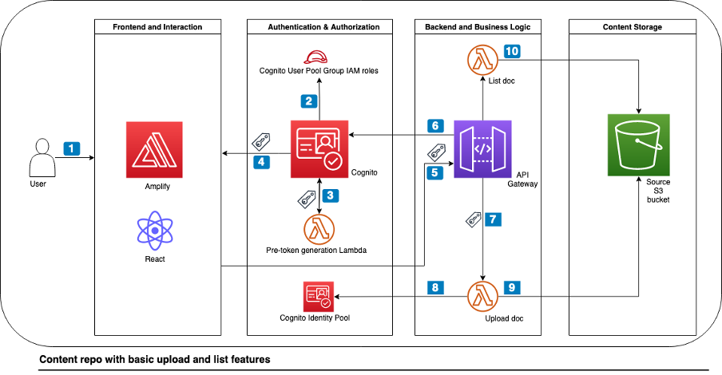

# Content Repository With Dynamic Access Control

This example walks you through how to build an end-to-end content repository using AWS services with a simple and dynamic access control based logic over unstructured data. This sample includes an AWS Cloud Development Kit (CDK) application to deploy the architectural foundation for the content repository as depicted in the diagram below. A simple react web UI to upload and list documents completes this demo environment. Further details can be found in this related [AWS architecture blog post](https://aws.amazon.com/blogs/architecture/content-repository-for-unstructured-data-with-multilingual-semantic-search-part-1). The code is not meant for production workloads.




<!--BEGIN STABILITY BANNER-->
---


> This is a stable example. It should successfully build out of the box.
>
> This prototype is built on CDK construct libraries marked "stable" with the exception of [amplify_alpha](https://docs.aws.amazon.com/cdk/api/v2/docs/aws-amplify-alpha-readme.html) but thoroughly tested.
<!--END STABILITY BANNER-->

## Prerequisites

You should have the following prerequisites to deploy the content repository with demo data:
* An AWS account or sign up to [create and activate one](https://aws.amazon.com/premiumsupport/knowledge-center/create-and-activate-aws-account/).
* The following software installed on your development machine, or use an [AWS Cloud9](https://aws.amazon.com/cloud9/) environment:
    * Install the [AWS Command Line Interface](https://aws.amazon.com/cli/) and [configure it to point to your AWS account](https://docs.aws.amazon.com/cli/latest/userguide/cli-chap-configure.html).
    * Install [TypeScript](https://www.typescriptlang.org/download) and use a package manager such as [npm](https://docs.npmjs.com/downloading-and-installing-packages-locally).
    * Install the [AWS CDK](https://docs.aws.amazon.com/cdk/latest/guide/getting_started.html).
 * Ensure that you have appropriate [AWS credentials](https://docs.aws.amazon.com/cli/latest/userguide/cli-configure-files.html) for interacting with resources in your AWS account.

## Deployment

Clone the project git repository:
```bash
git clone https://github.com/aws-samples/content-repository-with-dynamic-access-control
```

Install the necessary dependencies:
```bash
cd content-repository/backend-cdk
npm install
```

Configure environment variables::
```bash
export CDK_DEFAULT_ACCOUNT=$(aws sts get-caller-identity --query 'Account' --output text)
export CDK_DEFAULT_REGION=$(aws configure get region)
```

Bootstrap your account for AWS CDK usage:
```bash
cdk bootstrap aws://$CDK_DEFAULT_ACCOUNT/$CDK_DEFAULT_REGION
```

Deploy the code to your AWS account:
```bash
cdk deploy --all
```

This deploys two CDK stacks into your AWS account. The BlogContentRepositoryStack (content-repo-stack) creates the architecture and the DemoDataStack (demo-data-stack ) deploys sample users, groups and role mappings.

## Example walkthrough

1. Access the front-end application
    * Copy the value of the *amplifyHostedAppUrl* shown in the CDK output from the content-repo-stack.
    * Use the URL with your web browser to access the front-end application. You will see a temporary page until the automated build and deployment of the react application has been finished which takes a few minutes.
2. Application sign-in and role-based access control
    * The react webpage asks you to sign in first, then change the temporary password. You can find two demo users with credentials created as part of the demo-data-stack in the CDK output. In this walkthrough, we use the *sales-user* which belongs to the *sales* department group to validate RBAC.
3. Upload a document to the content repository
    * Authenticate as *sales-user*, then go ahead and upload your first document via the “upload” button to the content repository. You can find sample documents in the *assets* sub-folder from the cloned repository. 
4. List your uploaded document
    * Post successful upload process, click on the “list” button to show the upload sales content.
    * You can verify the dynamic access control by repeating the step 2 and 3 for the *marketing-user* belonging to the *marketing* department group. Additionally log into the AWS console and navigate to the S3 bucket with the prefix *content-repo-stack-s3sourcebucket* to check that all the uploaded content exists.

### Outlook
From here on you have the foundation to implement more complex access control use cases for the users of your departments by finding the right balance between IAM role and principal tags. For example, you can use Cognito user pool custom attributes for additional dimensions such as document “clearance” with optional modification in the pre token generation Lambda. 

## Cleaning up

In the subdirectory “backend-cdk”, delete the deployed resources:
```
cdk destroy –all 
```

## Useful commands
 * `cdk ls`          list all stacks in the app
 * `cdk synth`       emits the synthesized CloudFormation template
 * `cdk deploy`      deploy this stack to your default AWS account/region
 * `cdk diff`        compare deployed stack with current state
 * `cdk docs`        open CDK documentation

Enjoy!

## Security

See [CONTRIBUTING](CONTRIBUTING.md#security-issue-notifications) for more information.

## License

This library is licensed under the MIT-0 License. See the LICENSE file.
